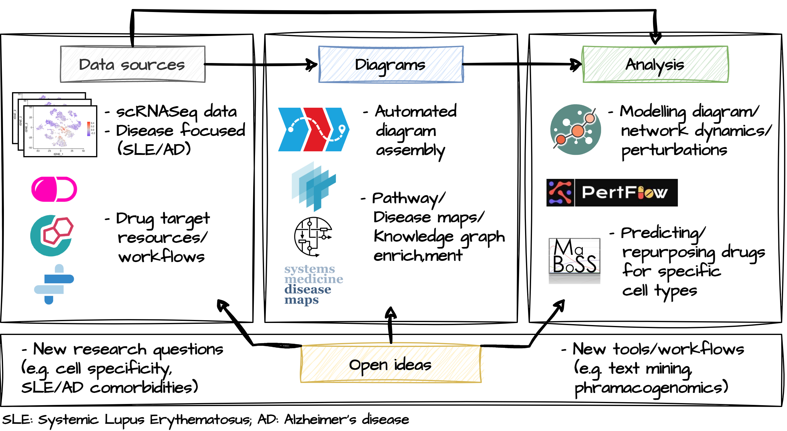

# Introduction

At the BioHackathon Europe 2023, our group developed workflows for streamlined discovery of druggable targets in single cell RNAseq data to support research of new treatments for human diseases. Our motivation was to address new challenges of data interpretation in rapidly growing universe of scRNAseq datasets. We focused on analysis of druggable targets for important cells in Systemic Lupus Erythematosus (SLE): GSE162577, GSE142016, GSE135779. Summary of our project plan can be seen in the figure below.

**Data** involved work on three SLE scRNAseq datasets to identify cell types significantly affected by the disorder. Additionally, in collaboration with [Project 17](https://github.com/elixir-europe/biohackathon-projects-2023/tree/main/17) we developed interfaces for acquisition of drug target information, needed in downstream steps.

**Diagrams** describes the work done to automatically assemble pathway and disease diagrams of mechanisms enriched in cell types identified in the *Data* step. We focused on the content from Reactome and Wikipathways databases, and from selected disease maps.

**Analysis** part used the inputs from *Data* and *Diagrams* to run selected modelling tools for discovering key druggable mechanisms in SLE. Cell type-specific differentially expressed genes (DEGs), and drugs targetting them were the focus of perturbation analyses.

By the end of the BioHackathon'23 we were able to significantly advance each of these areas:
- DEGs for selected cell types (basophils and B-cells) were calculated

- this was used to build two cell type-specific pathway maps available on a public server

- a plugin for the MINERVA Platform was developed allowin interactive expport of the most relevant parts of the diagrams using drug target information and expression data

- two methods of perturbation analysis can use the exported data for modelling analysis

- an indepentent, data-driven drug discovery workflow was run to compare results with the pathway-based discovery workflow.

These results are detailed below.

# Results

Description of the workflow.
Please keep sections to a maximum of only two levels.

## Data

**Single-cell dataset**

**Drug-target information**

## Maps

**Generation of map**

**Pruning of relevant components**

## Analysis

**Hipathia**

**Boolean modeling**
-   Construction of Boolean modelling: The diagrams analysed were obtained from the MINERVA Platform. This platform provides the capability to export specific diagrams from the map. The diagrams in CellDesigner SBML format were then automatically transformed into SBML-qual format using the CaSQ (CellDesigner as SBML-qual) tool. CaSQ uses specific rewriting rules to reduce diagrams from Process Description to Activity Flow notation, and to infer the logical functions and translate the interactions.
-   Topological analysis of the Boolean model: The structural and functional correctness of BM was evaluated by analysing the interactions between the biomolecules. To this end the topological features of the BM were analysed as a network.
-   Model analysis with different updating schemes: The behaviour of a BM under different update schemes was visualised through state transition graphs (see section 5 in the supplementary file), which represent all possible states of the system and the transitions between them. The state transition graph illustrates the range of outcomes for a given initial condition based on the update scheme used. Both update schemes demonstrated the ability to simulate expected system behaviour.
-   Perturbation analysis: A perturbation analysis was conducted to evaluate the effect on the topological robustness, dynamic resilience, and attractors reached by the models. Specifically, we focused on node perturbations, which alter the state of a single biomolecule through knockout and overexpressions.
-   Sensitivity analysis in response to different information: The evaluation was performed by performing sensitivity analysis on a selected set of models, examining each biomolecule. Sensitivity analysis is a technique that assesses how changes in a model or system's inputs affect its output, in this case, the two attractors reached by the model (unperturbed and perturbed). To quantify the difference between the two attractors, similarity-based distance and identity-based distance were used.
-   Stochastic Boolean model simulation: The simulations of the specified biological models were conducted using probabilistic Boolean modelling. This framework provides a tool for simulation of biological systems through discrete/continuous time Markov processes. It operates by utilising a Monte Carlo algorithm that simulates the system's evolution over time based on the initial conditions of the biomolecules and the interactions between them.

**PertFlow**
-  Probing for ground truths: Using Decoupler and pseudobulk analysis for distinct cell types, PertFlow enable the leveraging of active TFs and pathways preferentially perturbed in SLE compared to normal controls (e.g., RFX5, MEF2C, ELK4, Hypoxia, NFkb signalling) - these signaling components and patterns are corroborated by the pertinent literature
- Cell type prioritization: Deploying AugurPy package, PertFlow detected that NK T cells, B cells and Basophils were the most affect cell groups due to the SLE perturbation
- Drug Repurposing:   Using ASGARD package, PertFlow facilitated the repurposing of several compounds towards cell groups of interest (e.g., geldamycin that is under investigation for SLE was captured).

- **Network visualization** : Going beyond the current PertFlow architecture, a novel network model was created connecting genes to drugs to cell-types, creating an informative multi-partite graph that can be traversed and analyzed for deeper biological insights
- **Compatibility with Hipathia and boolean modelling**: The transformation of PertFlow results into a graph can enable a seamless integration with the modelling performed by Hipathia in terms of genes of interest, potential druggable targets and putative signaling cascades

# Discussion

# Concluding remarks

# Citation Typing Ontology annotation

You can use [CiTO](http://purl.org/spar/cito/2018-02-12) annotations, as explained in [this BioHackathon Europe 2021 write up](https://raw.githubusercontent.com/biohackrxiv/bhxiv-metadata/main/doc/elixir_biohackathon2021/paper.md) and [this CiTO Pilot](https://www.biomedcentral.com/collections/cito).
Using this template, you can cite an article and indicate _why_ you cite that article, for instance DisGeNET-RDF [@citesAsAuthority:Queralt2016].

The syntax in Markdown is as follows: a single intention annotation looks like
`[@usesMethodIn:Krewinkel2017]`; two or more intentions are separated
with colons, like `[@extends:discusses:Nielsen2017Scholia]`. When you cite two
different articles, you use this syntax: `[@citesAsDataSource:Ammar2022ETL; @citesAsDataSource:Arend2022BioHackEU22]`.

Possible CiTO typing annotation include:

* citesAsDataSource: when you point the reader to a source of data which may explain a claim
* usesDataFrom: when you reuse somehow (and elaborate on) the data in the cited entity
* usesMethodIn
* citesAsAuthority
* citesAsEvidence
* citesAsPotentialSolution
* citesAsRecommendedReading
* citesAsRelated
* citesAsSourceDocument
* citesForInformation
* confirms
* documents
* providesDataFor
* obtainsSupportFrom
* discusses
* extends
* agreesWith
* disagreesWith
* updates
* citation: generic citation

...

## Acknowledgements

...

## References
